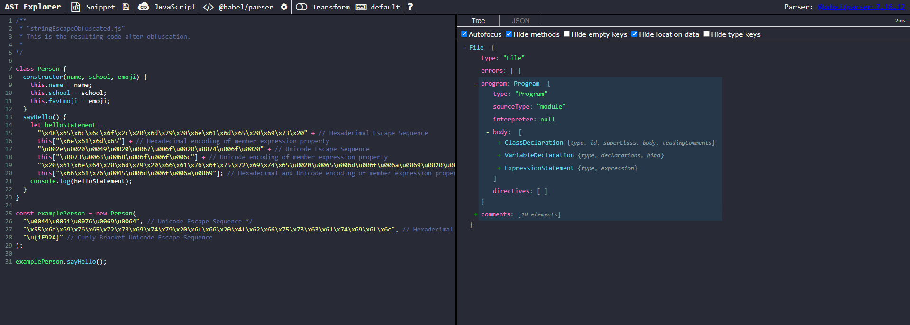
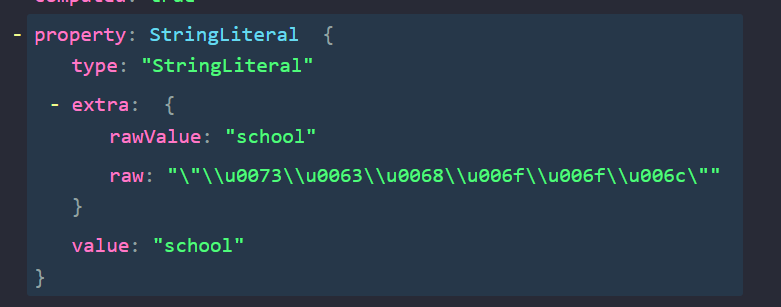
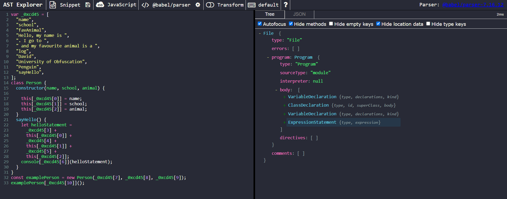
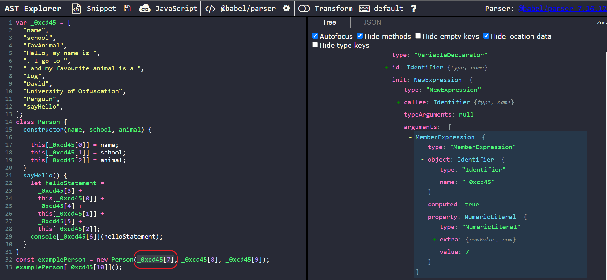
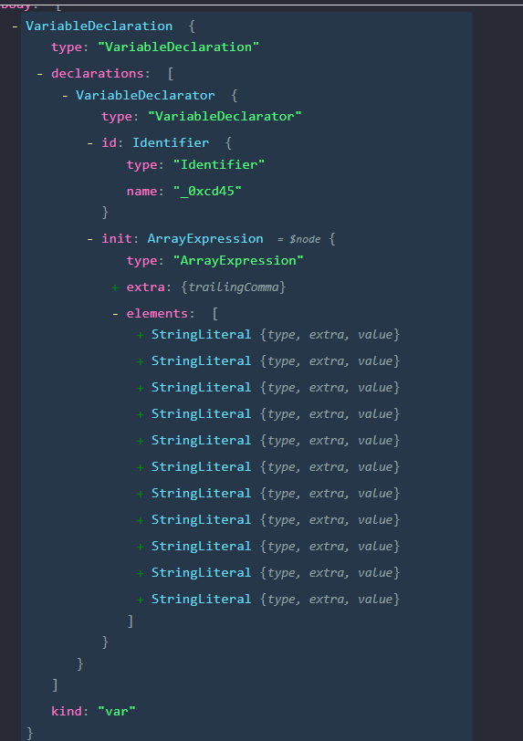
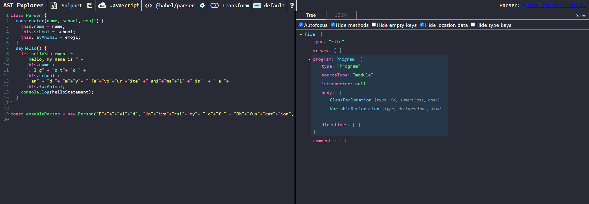
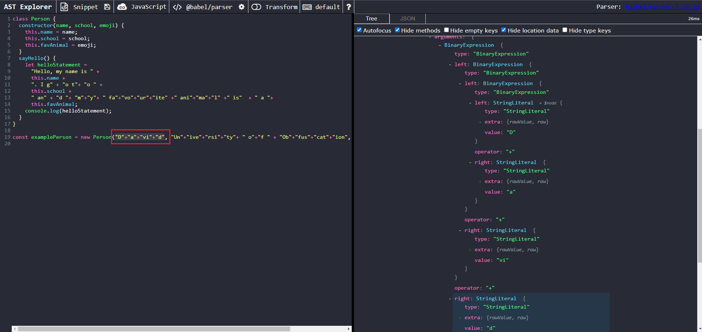
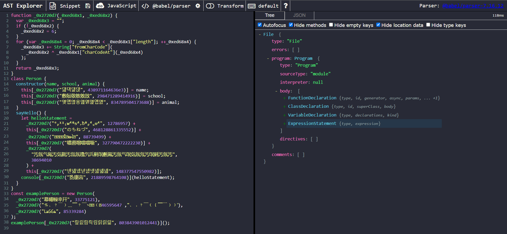
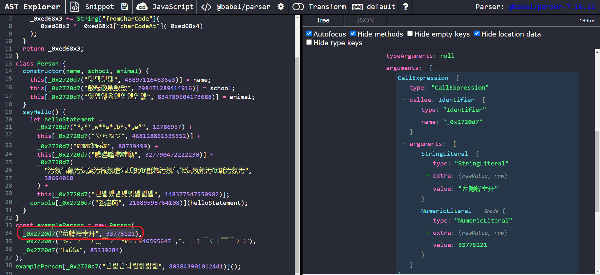

# Preface

This article assumes a preliminary understanding of Abstract Syntax Tree structure and [BabelJS](https://babeljs.io/). [Click Here](http://SteakEnthusiast.github.io/2022/05/21/Deobfuscating-Javascript-via-AST-An-Introduction-to-Babel/) to read my introductory article on the usage of Babel.

# What is String Concealing?

In JavaScript, string concealing is an obfuscation technique that transforms code in a way that disguises references to string literals. After doing so, the code becomes much less readable to a human at first glance. This can be done in multiple different ways, including but not limited to:

- Encoding the string as a hexadecimal/Unicode representation,
- Splitting a single string into multiple substrings, then concatenating them,
- Storing all string literals in a single array and referencing an element in the array when a string value is required
- Using an algorithm to encrypt strings, then calling a corresponding decryption algorithm on the encrypted value whenever its value needs to be read

In the following sections, I will provide some examples of these techniques in action and discuss how to reverse them.

# Examples

## Example #1: Hexadecimal/Unicode Escape Sequence Representations

Rather than storing a string as a literal, an author may choose to store it as an _[escape sequence](https://riptutorial.com/javascript/example/19374/escape-sequence-types)_. The javascript engine will parse the actual string literal value of an escaped string before it is used or printed to the console. However, it's virtually unreadable to an ordinary human. Below is an example of a sample obfuscated using this technique.

### Original Source Code

```Javascript

/**
 * "Input.js"
 * Original, unobfuscated code.
 *
*/

class Person {
  constructor(name, school, emoji) {
    this.name = name;
    this.school = school;
    this.favEmoji = emoji;
  }
  sayHello() {
    let helloStatement =
      "Hello, my name is " +
      this.name +
      ". I go to " +
      this.school +
      " and my favourite emoji is " +
      this.favEmoji;
    console.log(helloStatement);
  }
}

const examplePerson = new Person("David", "University of Obfuscation", "🤪");

examplePerson.sayHello();

```

### Post-Obfuscation Code

```Javascript
/**
 * "stringEscapeObfuscated.js"
 * This is the resulting code after obfuscation.
 *
*/

class Person {
  constructor(name, school, emoji) {
    this.name = name;
    this.school = school;
    this.favEmoji = emoji;
  }
  sayHello() {
    let helloStatement =
      "\x48\x65\x6c\x6c\x6f\x2c\x20\x6d\x79\x20\x6e\x61\x6d\x65\x20\x69\x73\x20" + // Hexadecimal Escape Sequence
      this["\x6e\x61\x6d\x65"] + // Hexadecimal encoding of member expression property
      "\u002e\u0020\u0049\u0020\u0067\u006f\u0020\u0074\u006f\u0020" + // Unicode Escape Sequence
      this["\u0073\u0063\u0068\u006f\u006f\u006c"] + // Unicode encoding of member expression property
      "\x20\x61\x6e\x64\x20\x6d\x79\x20\x66\x61\x76\x6f\x75\x72\x69\x74\x65\u0020\u0065\u006d\u006f\u006a\u0069\u0020\u0069\u0073\u0020" + // Hexadecimal and Unicode Mix Escape Sequence
      this["\x66\x61\x76\u0045\u006d\u006f\u006a\u0069"]; // Hexadecimal and Unicode encoding of member expression property
    console.log(helloStatement);
  }
}

const examplePerson = new Person(
  "\u0044\u0061\u0076\u0069\u0064", // Unicode Escape Sequence */
  "\x55\x6e\x69\x76\x65\x72\x73\x69\x74\x79\x20\x6f\x66\x20\x4f\x62\x66\x75\x73\x63\x61\x74\x69\x6f\x6e", // Hexadecimal Escape Sequence
  "\u{1F92A}" // Curly Bracket Unicode Escape Sequence
);

examplePerson.sayHello();

```

### Analysis Methodology

Despite appearing daunting at first glance, this obfuscation technique is relatively trivial to reverse. To begin, let's copy and paste the obfuscated sample into [AST Explorer](https://astexplorer.net/)



Our targets of interest here are the obfuscated strings, which are of type _StringLiteral_. Let's take a closer look at one of these nodes:



We can deduce two things from analyzing the structure of these nodes:

1. The actual, unobfuscated value has been parsed by Babel and is stored in the **_value_** property.
2. All nodes containing escaped text sequences have a property, **_extra_** which store the actual value and encoded text in **_extra.rawValue_** and **_extra.raw_** properties respectively

Since the parsed value is already stored in the **_value_** property, we can safely delete the **_extra_** property, causing Babel to default to the value property when generating the code and thereby restoring the original strings. To do this, we create a visitor that iterates through all _StringLiteral_to nodes to delete the \*\*\_extra_\*\* property if it exists. After that, we can generate code from the resulting AST to get the deobfuscated result. The babel implementation is shown below:

### Babel Deobfuscation Script

```Javascript
/**
 * Deobfuscator.js
 * The babel script used to deobfuscate the target file
 *
*/
const parser = require("@babel/parser");
const traverse = require("@babel/traverse").default;
const t = require("@babel/types");
const generate = require("@babel/generator").default;
const beautify = require("js-beautify");
const { readFileSync, writeFile } = require("fs");

/**
 * Main function to deobfuscate the code.
 * @param source The source code of the file to be deobfuscated
 *
 */
function deobfuscate(source) {
  /**
   * Visitor for removing encoding.
   */
  const deobfuscateEncodedStringVisitor = {
    StringLiteral(path) {
      if (path.node.extra) delete path.node.extra;
    },
  };

  //Parse AST of Source Code
  const ast = parser.parse(source);

  // Execute the visitor
  traverse(ast, deobfuscateEncodedStringVisitor);

  // Code Beautification
  let deobfCode = generate(ast, { comments: false }).code;
  deobfCode = beautify(deobfCode, {
    indent_size: 2,
    space_in_empty_paren: true,
  });
  // Output the deobfuscated result
  writeCodeToFile(deobfCode);
}
/**
 * Writes the deobfuscated code to output.js
 * @param code The deobfuscated code
 */
function writeCodeToFile(code) {
  let outputPath = "output.js";
  writeFile(outputPath, code, (err) => {
    if (err) {
      console.log("Error writing file", err);
    } else {
      console.log(`Wrote file to ${outputPath}`);
    }
  });
}

deobfuscate(readFileSync("./stringEscapeObfuscated.js", "utf8"));

```

After processing the obfuscated script with the babel plugin above, we get the following result:

### Post-Deobfuscation Result

```Javascript
class Person {
  constructor(name, school, emoji) {
    this.name = name;
    this.school = school;
    this.favEmoji = emoji;
  }

  sayHello() {
    let helloStatement = "Hello, my name is " + this["name"] + ". I go to " + this["school"] + " and my favourite emoji is " + this["favEmoji"];
    console.log(helloStatement);
  }

}

const examplePerson = new Person("David", "University of Obfuscation", "\uD83E\uDD2A"); // Babel won't generate the actual representation of non-ascii characters
examplePerson.sayHello();
```

The strings are now deobfuscated, and the code becomes much easier to read.

## Example #2: String-Array Map Obfuscation

This type of obfuscation removes references to string literals and places them in a special array. Whenever a value must be accessed, the obfuscated script will reference the original string's position in the string array. This technique is often combined with the previously discussed technique of storing strings as hexadecimal/unicode escape sequences. To isolate the point in this example, I've chosen not to include additional encoding. Below is an example of this obfuscation technique in practice:

### Original Source Code

```Javascript

/**
 * "Input.js"
 * Original, unobfuscated code.S
 *
*/

class Person {
  constructor(name, school, animal) {
    this.name = name;
    this.school = school;
    this.favAnimal = animal;
  }
  sayHello() {
    let helloStatement =
      "Hello, my name is " +
      this.name +
      ". I go to " +
      this.school +
      " and my favourite animal is a " +
      this.favAnimal;
    console.log(helloStatement);
  }
}

const examplePerson = new Person("David", "University of Obfuscation", "Penguin");

examplePerson.sayHello();

```

### Post-Obfuscation Code

```Javascript
/**
 * "stringArrayObfuscated.js"
 * This is the resulting code after obfuscation.
 *
*/

// This is the string array lookup table.
var _0xcd45 = [
  "name",
  "school",
  "favAnimal",
  "Hello, my name is ",
  ". I go to ",
  " and my favourite animal is a ",
  "log",
  "David",
  "University of Obfuscation",
  "Penguin",
  "sayHello",
];
class Person {
  constructor(name, school, animal) {
    // Member expression properties obfuscated using this technique
    this[_0xcd45[0]] = name;
    this[_0xcd45[1]] = school;
    this[_0xcd45[2]] = animal;
  }
  sayHello() {
    let helloStatement =
      _0xcd45[3] +
      this[_0xcd45[0]] +
      _0xcd45[4] +
      this[_0xcd45[1]] +
      _0xcd45[5] +
      this[_0xcd45[2]];
    console[_0xcd45[6]](helloStatement);
  }
}
const examplePerson = new Person(_0xcd45[7], _0xcd45[8], _0xcd45[9]);// Obfuscation of string arguments using this technique
examplePerson[_0xcd45[10]](); // Member expression property obfuscated using this technique

```

### Analysis Methodology

Similar to the first example, this obfuscation technique is mostly for show and very trivial to undo. To begin, let's copy and paste the obfuscated sample into [AST Explorer](https://astexplorer.net/)



Our targets of interest here are the master array, `_0xcd45` and its references. These references to it are of type _MemberExpression_. Let's take a closer look at one of the MemberExpression nodes of interest.



We can notice that, unlike the first example, babel does not compute the actual value of these member expressions for us. However, it does store the name of the array they are referencing and the position of the array to be accessed.

Let's now expand the _VariableDeclaration_ node that holds the string array.



We can observe that the name of the string array,`_0xcd45` is held in `path.node.declarations[0].id.name`. We can also see that `path.node.declarations[0].init.elements` is an array of nodes, which holds each node of the string literals declared in the string array. Finally, the string array is the first _VariableDeclaration_ with an init value of type _ArrayExpression_ encountered at the top of the file.

[_Note: Traditionally, javascript obfuscators put the string arrays at the top of the file/code block. However, sometimes this may not always be the case (e.g. other string-containing arrays are declared first or reassignment of the string array). You may need to make a slight modification to this step in that case._]

Using those observations, we can come up with the following logic to restore the code:

1. Traverse the ast to search for the variable declaration of the string array. To check if it is the string array's declaration, it must meet the following criteria:
   1. The _VariableDeclaration_ node must declare only **ONE** variable.
   2. Its corresponding _VariableDeclarator_ node must have an init property of type _ArrayExpression_
   3. **ALL** of the elements of the _ArrayExpression_ must be of type _StringLiteral_
2. After finding the declaration, we can:
   1. Store the string array's name in a variable, `stringArrayName`
   2. Store a copy of all its elements in a variable, `stringArrayElements`
3. Find all references to the string array. One of the most powerful features of Babel is it's support for _scopes_.

   From the [Babel Plugin Handbook](https://github.com/jamiebuilds/babel-handbook/blob/master/translations/en/plugin-handbook.md#toc-bindings):

   > References all belong to a particular scope; this relationship is known as a binding.

   We'll take advantage of this feature by doing the following:

   1. To ensure that we are getting the references to the correct identifier, we will get the path of the `id` property and store it in a variable, `idPath`.
   2. We will then get the binding of the string array, using `idPath.scope.getBinding(stringArrayName)` and store it in a variable, `binding`.
   3. If the binding does not exist, we will skip this variable declarator by returning early.
   4. The `constant` property of `binding` is a boolean determining if the variable is constant. If the value of `constant` is false (i.e, it is reassigned/modified), replacing the references will be unsafe. In that case, we will return early.
   5. The `referencePaths` property of `binding` is an array containing every NodePaths that reference the string array. We'll extract this to its own variable.

4. We will create a variable, `shouldRemove`, which will be a flag dictating whether or not we can remove the original _VariableDeclaration_. By default, we'll initialize it to `true`. More on this in the next step.

5. We will loop through each individual `referencePath` of the `referencePaths` array, and check if they meet all the following criteria:

   1. The parent NodePath of the current `referencePath` must be a MemberExpression. The reason we are checking the parent node is because the `referencePath` refers to the actual referenced identifier (in our example, `_0xcd45`), which would be contained in a MemberExpression parent node (such as `_0xcd45[0]`)
   2. The parent NodePath's `object` field must be the the current referencePath's node (that is, it must be the string array's identifier)
   3. The parent NodePath's `computed` field must be `true`. This means that bracket notation is being used for member access (ex. `_0xcd45[0]`).
   4. The parent NodePath's `property` field must be of type `NumericLiteral`, so we can use it's value to access the corresponding node by index.

6. If all of these criteria are met, we can lookup the corresponding node in our `stringArrayElements` array using the value stored in the parent NodePath's `property` field, and safely replace the `referencePath`'s parent path with it (that is, replace the entire MemberExpression with the actual string).
7. If at least one of these conditions are not met for the current `referencePath`, we will be unable to replace the referencePath. In this case, removing the original VariableDeclarator of the string array would be unsafe, since these references to it would be in the final code. Therefore, we should set our `shouldDelete` flag to false. We'll then skip to the next iteration of the for loop.

8. After we have finished iterating over all the referencePaths, we will use the value of our `shouldRemove` flag to determine if it is safe to remove the original _VariableDeclaration_.

- If `shouldRemove` still has the default value of `true`, that means all referencePaths have been successfully replaced, and the original declaration of the string array is no longer needed, so we can remove it.
- If `shouldRemove` is equal to `false`, we encountered a referencePath that we could not replace. It is then unsafe to remove the original declaration of the string array, so we don't remove it.

The Babel implementation is shown below:

### Babel Deobfuscation Script

```Javascript
/**
 * Deobfuscator.js
 * The babel script used to deobfuscate the target file
 *
 */

const parser = require("@babel/parser");
const traverse = require("@babel/traverse").default;
const t = require("@babel/types");
const generate = require("@babel/generator").default;
const beautify = require("js-beautify");
const { readFileSync, writeFile } = require("fs");

/**
 * Main function to deobfuscate the code.
 * @param source The source code of the file to be deobfuscated
 *
 */
function deobfuscate(source) {
  /**
   * Visitor for removing encoding.
   */

  const deobfuscateStringArrayVisitor = {
    VariableDeclaration(path) {
      const { declarations } = path.node;
      if (
        // The VariableDeclaration node must declare only ONE variable.
        declarations.length !== 1 ||
        // It's corresponding VariableDeclarator node must have an init property of type ArrayExpression
        !t.isArrayExpression(declarations[0].init)
      )
        return; //skip

      const stringArrayElements = [];
      for (const elementNode of declarations[0].init.elements) {
        // ALL of the elements of the ArrayExpression_must be of type StringLiteral
        if (!t.isStringLiteral(elementNode)) return;
        else {
          // Store a copy of all its elements in a variable
          stringArrayElements.push(elementNode);
        }
      }
      // Store the string array's name in a variable
      const stringArrayName = declarations[0].id.name;
      // Get the path of the identifier. By using this path, we ensure we will ALWAYS correctly refer to the scope of the array
      const idPath = path.get("declarations.0.id");
      // Get the binding of the array.
      const binding = idPath.scope.getBinding(stringArrayName);

      if (!binding) return;

      const { constant, referencePaths } = binding;

      // This wouldn't be safe if the array was not constant.
      if (!constant) return;
      // This decides if we can remove the array or not.
      // If there are any references to the array that cannot be replaced, it is unsafe to remove the original VariableDeclaration.
      let shouldRemove = true;

      for (const referencePath of referencePaths) {
        const { parentPath: refParentPath } = referencePath;
        const { object, computed, property } = refParentPath.node;
        // Criteria to be a valid path for replacement:
        // The refParent must be of type MemberExpression
        // The "object" field of the refParent must be a reference to the array (the original referencePath)
        // The "computed" field of the refParent must be true (indicating use of bracket notation)
        // The "property" field of the refParent must be a numeric literal, so we can access the corresponding element of the array by index.
        if (
          !(
            t.isMemberExpression(refParentPath.node) &&
            object == referencePath.node &&
            computed == true &&
            t.isNumericLiteral(property)
          )
        ) {
          // If the above conditions aren't met, we've run into a reference that can't be replaced.
          // Therefore, it'd be unsafe to remove the original variable declaration, since it will still be referenced after our transformation has completed.
          shouldRemove = false;
          continue;
        }

        // If the above conditions are met:

        // Replace the parentPath of the referencePath (the actual MemberExpression) with it's actual value.

        refParentPath.replaceWith(stringArrayElements[property.value]);
      }

      if (shouldRemove) path.remove();
    },
  };

  //Parse AST of Source Code
  const ast = parser.parse(source);

  // Execute the visitor
  traverse(ast, deobfuscateStringArrayVisitor);

  // Code Beautification
  let deobfCode = generate(ast, { comments: false }).code;
  deobfCode = beautify(deobfCode, {
    indent_size: 2,
    space_in_empty_paren: true,
  });
  // Output the deobfuscated result
  writeCodeToFile(deobfCode);
}
/**
 * Writes the deobfuscated code to output.js
 * @param code The deobfuscated code
 */
function writeCodeToFile(code) {
  let outputPath = "output.js";
  writeFile(outputPath, code, (err) => {
    if (err) {
      console.log("Error writing file", err);
    } else {
      console.log(`Wrote file to ${outputPath}`);
    }
  });
}

deobfuscate(readFileSync("./stringArrayObfuscated.js", "utf8"));


```

After processing the obfuscated script with the babel plugin above, we get the following result:

### Post-Deobfuscation Result

```Javascript
class Person {
  constructor(name, school, animal) {
    this["name"] = name;
    this["school"] = school;
    this["favAnimal"] = animal;
  }

  sayHello() {
    let helloStatement = "Hello, my name is " + this["name"] + ". I go to " + this["school"] + " and my favourite animal is a " + this["favAnimal"];
    console["log"](helloStatement);
  }

}

const examplePerson = new Person("David", "University of Obfuscation", "Penguin");
examplePerson["sayHello"]();
```

The strings are now deobfuscated, and the code becomes much easier to read.

## Example #3: String Concatenation

This type of obfuscation, in its most basic form, takes a string such as the following:

```javascript
let myString = "Hello World";
```

And splits it into multiple parts:

```javascript
let myString = "He" + "l" + "l" + "o W" + "o" + "rl" + "d"; // => Hello World
```

You might be thinking, "Hey, the obfuscated version doesn't look that bad", and you'd be right. However, keep in mind that a file will typically have a lot more obfuscation layered on top. An example using the techniques already covered above could look something like this (or likely more advanced):

```javascript
var _0xba8a = ["\x48\x65", "\x6C", "\x6F\x20\x57", "\x6F", "\x72\x6C", "\x64"]; //Encoded string array
let myString =
  _0xba8a[0] +
  _0xba8a[1] +
  _0xba8a[1] +
  _0xba8a[2] +
  _0xba8a[3] +
  _0xba8a[4] +
  _0xba8a[5]; // string concatenation
```

The following analysis will only cover the most basic case from the first example I showed you. Traditionally, a file's obfuscation layers are peeled back one at a time. Your goal as a reverse engineer would be to make transformations to the code such that it looks like the basic case and _only then_ apply this analysis.

### Original Source Code

```Javascript

/**
 * "Input.js"
 * Original, unobfuscated code.
 *
*/

class Person {
  constructor(name, school, animal) {
    this.name = name;
    this.school = school;
    this.favAnimal = animal;
  }
  sayHello() {
    let helloStatement =
      "Hello, my name is " +
      this.name +
      ". I go to " +
      this.school +
      " and my favourite animal is a " +
      this.favAnimal;
    console.log(helloStatement);
  }
}

const examplePerson = new Person("David", "University of Obfuscation", "DOGGO");

examplePerson.sayHello();

```

### Post-Obfuscation Code

```Javascript
/**
 * "stringConcatenationObfuscated.js"
 * This is the resulting code after obfuscation.
 *
*/

class Person {
  constructor(name, school, emoji) {
    this.name = name;
    this.school = school;
    this.favAnimal = emoji;
  }
  sayHello() {
    let helloStatement =
      "Hello, my name is " +
      this.name +
      ". I g" + "o t"+ "o " +
      this.school +
      " an" + "d "+ "m"+"y"+ " fa"+"vo"+"ur"+"ite" +" ani"+"ma"+"l" +" is"  + " a "+
      this.favAnimal;
    console.log(helloStatement);
  }
}

const examplePerson = new Person("D"+"a"+"vi"+"d", "Un"+"ive"+"rsi"+"ty"+ " o"+"f " + "Ob"+"fus"+"cat"+"ion", "D"+"O"+"G"+"G"+"O");

examplePerson.sayHello();

```

### Analysis Methodology

Let's paste our obfuscated code into [AST Explorer](https://astexplorer.net/).



Our targets of interest here are all of the strings being concatenated. Let's click on one of them to take a closer look at one of the nodes of interest.



We can make the following observations from the AST structure:

1. We can see that each individual substring is of type _StringLiteral_.
2. More importantly, the string literals seem to be contained in multiple nested _BinaryExpressions_.

So how could we go about solving this?

There are a few ways to do this. One would be to work up recursively from the right-most _StringLiteral_ node in the binary expression and manually concatenate the string at each step. However, there's a much simpler way to accomplish the same thing using Babel's inbuilt _path.evaluate()_ function. The steps for coding the deobfuscator are included below:

1. Traverse through the AST to search for BinaryExpressions
2. If a BinaryExpression is encountered, try to evaluate it using path.evaluate().
3. If path.evaluate returns _confident:true_, check if the evaluated value is a _StringLiteral_. If either condition is false, return.
4. Replace the BinaryExpression node with the computed value as a _StringLiteral_, stored in _value_.

The babel implementation is shown below:

### Babel Deobfuscation Script

```Javascript
/**
 * Deobfuscator.js
 * The babel script used to deobfuscate the target file
 *
 */
const parser = require("@babel/parser");
const traverse = require("@babel/traverse").default;
const t = require("@babel/types");
const generate = require("@babel/generator").default;
const beautify = require("js-beautify");
const { readFileSync, writeFile } = require("fs");

/**
 * Main function to deobfuscate the code.
 * @param source The source code of the file to be deobfuscated
 *
 */
function deobfuscate(source) {
  const deobfuscateStringConcatVisitor = {
    BinaryExpression(path) {
      let { confident, value } = path.evaluate(); // Evaluate the binary expression
      if (!confident) return; // Skip if not confident
      if (typeof value == "string") {
        path.replaceWith(t.stringLiteral(value)); // Substitute the simplified value
      }
    },
  };

  //Parse AST of Source Code
  const ast = parser.parse(source);

  // Execute the visitor
  traverse(ast, deobfuscateStringConcatVisitor);

  // Code Beautification
  let deobfCode = generate(ast, { comments: false }).code;
  deobfCode = beautify(deobfCode, {
    indent_size: 2,
    space_in_empty_paren: true,
  });
  // Output the deobfuscated result
  writeCodeToFile(deobfCode);
}
/**
 * Writes the deobfuscated code to output.js
 * @param code The deobfuscated code
 */
function writeCodeToFile(code) {
  let outputPath = "output.js";
  writeFile(outputPath, code, (err) => {
    if (err) {
      console.log("Error writing file", err);
    } else {
      console.log(`Wrote file to ${outputPath}`);
    }
  });
}

deobfuscate(readFileSync("./stringConcatenationObfuscated.js", "utf8"));


```

After processing the obfuscated script with the babel plugin above, we get the following result:

### Post-Deobfuscation Result

```Javascript
class Person {
  constructor(name, school, emoji) {
    this.name = name;
    this.school = school;
    this.favAnimal = emoji;
  }

  sayHello() {
    let helloStatement = "Hello, my name is " + this.name + ". I g" + "o t" + "o " + this.school + " an" + "d " + "m" + "y" + " fa" + "vo" + "ur" + "ite" + " ani" + "ma" + "l" + " is" + " a " + this.favAnimal;
    console.log(helloStatement);
  }

}

const examplePerson = new Person("David", "University of Obfuscation", "DOGGO");
examplePerson.sayHello();

```

But hold on, that looks only **_partly deobfuscated_**!

### A Minor Complication

Okay, I may have lied to you a bit. The example I gave you actually contains two cases. The simplest case with ONLY string literals:

```javascript
const examplePerson = new Person(
  "D" + "a" + "vi" + "d",
  "Un" + "ive" + "rsi" + "ty" + " o" + "f " + "Ob" + "fus" + "cat" + "ion",
  "D" + "O" + "G" + "G" + "O"
);
```

And the bit more advanced case, where string literals are mixed with non-string literals (in this case, variables):

```javascript
let helloStatement =
  "Hello, my name is " +
  this.name +
  ". I g" +
  "o t" +
  "o " +
  this.school +
  " an" +
  "d " +
  "m" +
  "y" +
  " fa" +
  "vo" +
  "ur" +
  "ite" +
  " ani" +
  "ma" +
  "l" +
  " is" +
  " a " +
  this.favAnimal;
```

The above algorithm will not work for the second case as is. However, there's a simple remedy. Simply edit the obfuscated file to wrap consecutive strings in brackets like so:

```javascript
let helloStatement =
  "Hello, my name is " +
  this.name +
  (". I g" + "o t" + "o ") +
  this.school +
  (" an" +
    "d " +
    "m" +
    "y" +
    " fa" +
    "vo" +
    "ur" +
    "ite" +
    " ani" +
    "ma" +
    "l" +
    " is" +
    " a ") +
  this.favAnimal;
```

And our deobfuscator will output our desired result:

```javascript
let helloStatement =
  "Hello, my name is " +
  this.name +
  ". I go to " +
  this.school +
  " and my favourite animal is a " +
  this.favAnimal;
```

I'm sure some of you might be wondering why the algorithm doesn't work without manually adding the brackets. This is outside of the scope of this article. However, if you're interested in the reason for this intricacy and an algorithm that simplifies it _**without needing to manually add the brackets**_, check out my article about _[Constant Folding](http://SteakEnthusiast.github.io/2022/05/28/Deobfuscating-Javascript-via-AST-Manipulation-Constant-Folding/)_. But for now, I'll move on to another example.

## Example #4: String Encryption

First and foremost, string encryption **_IS NOT_** the same as encoding strings as hexadecimal or unicode. Whereas the javascript interpreter will automatically interpret`"\x48\x65\x6c\x6c\x6f"` as `"Hello"`, encrypted strings must be passed through to a decryption function and evaluated _before_ they become useful to the javascript engine (or representable as a StringLiteral by Babel).

For example, even though Base64 is a type of encoding, in the context of string concealing it falls under string encryption since `console.log("SGVsbG8=")` prints `SGVsbG8=`, but `console.log(atob{SGVsbG8=})` prints `Hello`. In this example, atob() is the decoding function.

Most obfuscators will define custom functions for encrypting and decrypting strings. Sometimes, the string may need to go through multiple decryption functions Therefore, there is no universal solution for deobfuscating string encryption. Most of the time, you'll need to manually analyze the code to find the string decryption function, hard-code it into your deobfuscator, then evaluate it for each CallExpression that references it. The example below will cover a single example that uses an XOR cipher from [this repository](https://github.com/RobLoach/xor-crypt) for obfuscating the strings.

### Original Source Code

```Javascript

/**
 * "Input.js"
 * Original, unobfuscated code.
 *
*/

class Person {
  constructor(name, school, animal) {
    this.name = name;
    this.school = school;
    this.favAnimal = animal;
  }
  sayHello() {
    let helloStatement =
      "Hello, my name is " +
      this.name +
      ". I go to " +
      this.school +
      " and my favourite animal is a " +
      this.favAnimal;
    console.log(helloStatement);
  }
}

const examplePerson = new Person("David", "University of Obfuscation", "DOGGO");

examplePerson.sayHello();

```

### Post-Obfuscation Code

```Javascript
/**
 * "stringEncryptionObfuscated.js"
 * This is the resulting code after obfuscation.
 *
*/

/**
 * The decryption function
 * A simple implementation of an XOR cipher.
 * @param _0xed68x1 The string to be decrypted
 * @param _0xed68x2 The decryption key
*/
function _0x2720d7(_0xed68x1, _0xed68x2) {
  var _0xed68x3 = "";
  if (!_0xed68x2) {
    _0xed68x2 = 6;
  }
  for (var _0xed68x4 = 0; _0xed68x4 < _0xed68x1["length"]; ++_0xed68x4) {
    _0xed68x3 += String["fromCharCode"](
      _0xed68x2 ^ _0xed68x1["charCodeAt"](_0xed68x4)
    );
  }
  return _0xed68x3;
}
class Person {
  constructor(name, school, animal) {
    this[_0x2720d7("댎댁댍댅", 438971164636e3)] = name;
    this[_0x2720d7("敷敧敬敫敫敨", 298471289414916)] = school;
    this[_0x2720d7("옞옙옎옹옖옑옕옙옔", 834789504173688)] = animal;
  }
  sayHello() {
    let helloStatement =
      _0x2720d7("ᵅᵨᵡᵡᵢᴡᴭᵠᵴᴭᵣᵬᵠᵨᴭᵤᵾᴭ", 12786957) +
      this[_0x2720d7("のちねづ", 468128861335552)] +
      _0x2720d7("຅຋໢຋໌ໄ຋ໟໄ຋", 88739499) +
      this[_0x2720d7("噥噵噾噹噹噺", 327790472222230)] +
      _0x2720d7(
        "汚氛气氞汚気氃汚氜氛氌氕氏氈氓氎氟汚氛气氓気氛氖汚氓氉汚氛汚",
        38694010
      ) +
      this[_0x2720d7("녠녧녰녇녨녯녫녧녪", 148377547550982)];
    console[_0x2720d7("㐠㐣㐫", 21889598764108)](helloStatement);
  }
}
const examplePerson = new Person(
  _0x2720d7("幕幰幧幸幵", 33775121),
  _0x2720d7("﹪﹑﹖﹉﹚﹍﹌﹖﹋﹆︟﹐﹙︟ﹰ﹝﹙﹊﹌﹜﹞﹋﹖﹐﹑", 46595647),
  _0x2720d7("Ⳑⳛⳓⳓⳛ", 85339284)
);
examplePerson[_0x2720d7("릪릸릠릑림릵릵릶", 803843901012441)]();

```

### Analysis Methodology

Let's paste our obfuscated code into [AST Explorer](https://astexplorer.net/).



Our targets of interest here are the cryptic calls to the `_0x2720d7` function. Let's take a closer a closer look at one of them.



We can observe that the nodes of interest are of type _CallExpression_. Each call expression takes in two parameters. The first is a _StringLiteral_ which holds the encrypted string. The second is a _NumericLiteral_, which is used as a decryption key.

There are two ways we can deobfuscate this script, the second of which I personally prefer since it looks cleaner.

#### **Method #1: The Copy-Paste Technique**

The first method involves the following steps:

1. Find the decryption function in the obfuscated script
2. Paste the decryption function, `_0x2720d7`, in our deobfuscator
3. Traverse the ast in search for the FunctionDeclaration of the decryption function (in this case, `_0x2720d7`). Once found, remove the path as it is no longer necessary
4. Traverse the ast in search of CallExpressions where the callee is the decryption function (in this case, `_0x2720d7`). Once found:
   1. Assign each arugument of `path.node.arguments` to a variable, e.g. `stringToDecrypt` and `decryptionKey` respectively.
   2. Create a variable, `result`
   3. Evaluate `_0x2720d7(stringToDecrypt,decryptionKey)` and assign the resulting value to `result`
   4. Replace the CallExpression path with the actual value: `path.replaceWith(t.valueToNode(result))`

One of the reasons I don't like to use this method is that the code for the deobfuscator can become quite long and messy if:

- The decryption function contains many lines of code, or
- There are many parameters to parse from the CallExpression

A cleaner approach in my opinion is the next method, which evaluates the decryption function and its calls in a _virtual machine_.

#### **Method #2: Using the NodeJS VM module**

Whenever possible, I prefer to use this method because of its cleanliness. Why? Well,

- It doesn't require me to copy-paste the entire encryption function into my deobfuscator
- I don't need to manually parse any of the arguments of CallExpressions before execution.

The only downside is that it requires two separate visitors and therefore two traversals, whereas you can probably implement the first method in a single traversal.

Here are the steps to implement it:

1. Create a variable, `decryptFuncCtx`and assign it an empty context using `vm.createContext()`
2. Traverse the ast in search for the FunctionDeclaration of the decryption function (in this case, `_0x2720d7`). Once found:
   1. Use `@babel/generator` to generate the function's source code from the node and assign it to a variable, `decryptFuncCode`
   2. Add the decryption function to the VM's context using `vm.runInContext(decryptFuncCode, decryptFuncCtx)`
   3. Delete the FunctionDeclaration node with `path.remove()` as it's now useless, and stop traversing with `path.stop()`
3. Traverse the ast in search of CallExpressions where the callee is the decryption function (in this case, `_0x2720d7`). Once found:
   1. Use `@babel/generator` to generate the CallExpression's source code from the node and assign it to a variable, `expressionCode`
   2. Evaluate the function call in the context of `decryptFuncCtx` using `vm.runInContext(expressionCode,decryptFuncCtx)`.
   3. Optionally assign the result to a variable, `value`
   4. Replace the CallExpression node with the computed value to restore the unobfuscated string literal.

**Note**: _for both of these methods you should probably come up with a dynamic way to detect the decryption function (by analyzing the structure of the function node or # of calls) in case the script is morphing. You should also pay mind to the scope of function and also check if it's ever redefined later in the script. But for this example, I will neglect that and just hardcode the name for simplicity._

The babel implementation for the second method is shown below:

### Babel Deobfuscation Script

```Javascript
/**
 * Deobfuscator.js
 * The babel script used to deobfuscate the target file
 *
 */
const parser = require("@babel/parser");
const traverse = require("@babel/traverse").default;
const t = require("@babel/types");
const generate = require("@babel/generator").default;
const beautify = require("js-beautify");
const { readFileSync, writeFile } = require("fs");
const vm = require("vm");
const { create } = require("chrome-remote-interface-extra/lib/page/Page");
/**
 * Main function to deobfuscate the code.
 * @param source The source code of the file to be deobfuscated
 *
 */
function deobfuscate(source) {
  //Parse AST of Source Code
  const ast = parser.parse(source);

  const decryptFuncCtx = vm.createContext();
  // Visitor for populating the VM context
  const createDecryptFuncCtxVisitor = {
    FunctionDeclaration(path) {
      const node = path.node;
      if (node.id.name == "_0x2720d7") {// Hard-coded decryption function name for simplification

        const decryptFuncCode = generate(node).code; // Generate the code to execute in context
        vm.runInContext(decryptFuncCode, decryptFuncCtx); // Execute the decryption function delcaration in VM context
        path.remove() // Remove the decryption function since it has served its use
        path.stop(); // stop traversing once the decryption function has been added to the context

      }
    },
  };

  // Visitor for decrypting the string
  const deobfuscateEncryptedStringsVisitor = {
    CallExpression(path) {
      const node = path.node;
      if (node.callee.name == "_0x2720d7") { // Hard-coded decryption function name for simplification


        const expressionCode = generate(node).code; // Convert the CallExpression to code
        const value = vm.runInContext(expressionCode, decryptFuncCtx); // Evaluate the code
        path.replaceWith(t.valueToNode(value)); // Replace the node with the resulting value.
      }
    },
  };
  // Create the context
  traverse(ast, createDecryptFuncCtxVisitor);
  // Decrypt all strings
  traverse(ast, deobfuscateEncryptedStringsVisitor);

  // Code Beautification
  let deobfCode = generate(ast, { comments: false }).code;
  deobfCode = beautify(deobfCode, {
    indent_size: 2,
    space_in_empty_paren: true,
  });
  // Output the deobfuscated result
  writeCodeToFile(deobfCode);
}
/**
 * Writes the deobfuscated code to output.js
 * @param code The deobfuscated code
 */
function writeCodeToFile(code) {
  let outputPath = "output.js";
  writeFile(outputPath, code, (err) => {
    if (err) {
      console.log("Error writing file", err);
    } else {
      console.log(`Wrote file to ${outputPath}`);
    }
  });
}

deobfuscate(readFileSync("./stringEncryptionObfuscated.js", "utf8"));


```

After processing the obfuscated script with the babel plugin above, we get the following result:

### Post-Deobfuscation Result

```Javascript
class Person {
  constructor(name, school, animal) {
    this["name"] = name;
    this["school"] = school;
    this["favAnimal"] = animal;
  }

  sayHello() {
    let helloStatement = "Hello, my name is " + this["name"] + ". I go to " + this["school"] + " and my favourite animal is a " + this["favAnimal"];
    console["log"](helloStatement);
  }

}

const examplePerson = new Person("David", "University of Obfuscation", "DOGGO");
examplePerson["sayHello"]();
```

The strings are now deobfuscated, and the code becomes much easier to read.

## Conclusion

Phew, that was quite the long segment! That about sums up the majority of string concealing techniques you'll find in the wild and how to reverse them.

Before I go, I want to address one thing (as a bonus of sorts):

After deobfuscating the strings, we can see that they're restored to:

```javascript
this["name"] = name;
this["school"] = school;
this["favAnimal"] = animal;
```

But someone familiar with Javascript knows that the convention is to write it like this:

```javascript
this.name = name;
this.school = school;
this.favAnimal = animal;
```

The good news is, you can also use Babel to restore the traditional dot operator formatting in MemberExpressions. [Read my article about it here!](https://SteakEnthusiast.github.io/2022/05/28/Deobfuscating-Javascript-via-AST-Manipulation-Converting-Bracket-Notation-Dot-Notation-for-Property-Accessors/)

If you're interested, you can find the source code for all the examples in [this repository](https://github.com/SteakEnthusiast/Supplementary-AST-Based-Deobfuscation-Materials).

I hope that this article helped you learn something new. Thanks for reading, and happy reversing!
